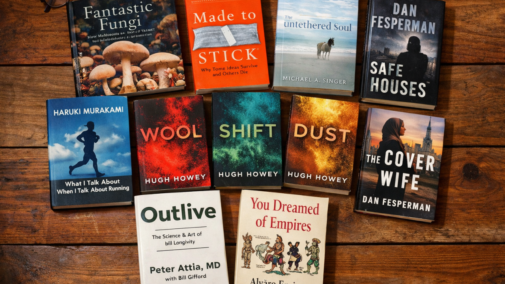

### Made to Stick: Why Some Ideas Survive and Others Die by Chip Heath and Dan Heath

One of the better communication books I read this year. At its core is the "Curse of Knowledge": once we master something, we forget what it's like not to know it. That blind spot makes explaining ideas clearly far harder than we realize.

The authors show how effective communicators work around this curse—by opening curiosity gaps instead of dumping information all at once, and by stripping ideas down to their essence until nothing more can be removed without losing meaning. Practical, memorable, and immediately useful.

### The Untethered Soul by Michael A. Singer

I hadn't heard of Singer until a friend deep into spirituality recommended him. The book's central idea is simple yet profound: you are not the constant voice in your head—you are the awareness that hears it. Identifying with that voice, Singer argues, is the root of most inner turmoil.

Much of our suffering comes from resisting life's flow. When uncomfortable emotions arise, we close ourselves off, storing unresolved impressions ("samskaras") that later get triggered by seemingly trivial events. Rather than trying to control the outside world or avoid pain, Singer urges us to stay open and let feelings pass through us like wind. Over time, those stored blockages loosen, and the heart expands. Profound insights written in an easy-to-read manner.

### What I Talk About When I Talk About Running by Haruki Murakami

I've read this slim memoir several times over the years. Even though I've never picked up one of Murakami's novels, I keep returning to it. Part personal reflection, part meditation on running, and part exploration of the writing life, it weaves all three into a quiet philosophy of discipline and solitude.

Through stories of marathons, an ultramarathon, triathlons, and the gradual slowdown that comes with age, Murakami shows how endurance sports cultivate resilience and self-knowledge—always focused on personal goals rather than external validation. His line, "Pain is inevitable. Suffering is optional," captures the book's core insight. The parallels he draws between long-distance running and novel-writing—daily practice, patience, and mental emptiness—are quietly compelling. An effortless, thoughtful read that rewards revisiting.

### Wool, Shift, and Dust by Hugh Howey

I picked up Wool after watching Silo on Apple TV. The first book stays inside a single silo, tracing the politics, secrets, and tensions that accumulate over time. Rebellions, "cleanings," and revelations about the outside world drive a story centered on control, truth, and courage.

Shift and Dust pull the camera back, explaining how—and why—the silos were built in the first place. Some sections drag and feel overlong, but overall the series is a wonderful read.

### Safe Houses and The Cover Wife by Dan Fesperman

I usually turn to Steve Berry or Daniel Silva for guilty-pleasure spy thrillers, but their recent books haven't landed for me. Looking for something similar, I discovered Dan Fesperman.

These aren't high-octane, Bond-style adventures. Instead, they focus on real spycraft: tradecraft, quiet tension, moral ambiguity, and the slow burn of intelligence work. Safe Houses stood out most. It unfolds across two timelines—1979, following a young CIA officer who uncovers something dangerous, and 2014, where an investigator pieces together what went wrong.

The Cover Wife follows the 9/11 hijackers during their time in Hamburg, partly through the eyes of a CIA officer working under non-official cover. It's a grounded, unsettling look at how intelligence failures can happen in plain sight.

Clean prose, believable characters, and no over-the-top gadgets or shootouts—both books feel fresh and thoughtfully handled.

### Fantastic Fungi by Paul Stamets

I'm not entirely sure how I ended up reading an introduction to mycology, but I'm glad I did. One of the book's most awe-inspiring revelations is the vast, hidden world beneath our feet. When we see mushrooms, we're seeing only the surface expression of something much larger: only about 10 percent of fungi produce mushrooms at all. Beneath each one lies an enormous network of mycelium, spreading invisibly through the soil.

That network extends under every step we take, creating the soils that nourish life on land and forming the foundation of terrestrial ecosystems. After reading this, you can't go for a hike without seeing the ground differently.

### Outlive by Peter Attia

One of my favorite books of 2025—and one of the few that genuinely felt life-changing.

The message is blunt: if you want to reach 80 or beyond and still be active, independent, and healthy, you can't wait until later to prepare. You have to start now. Attia focuses on extending healthspan—the years you live well—rather than just lifespan, arguing for a shift from reactive "Medicine 2.0" to proactive "Medicine 3.0," where prevention comes first.

His strongest emphasis is on exercise as the single most powerful longevity tool: improving VO₂ max, preserving muscle through strength training, and building stability to prevent falls. He frames it around the "Centenarian Decathlon"—training today for the physical tasks you want to perform at 100, like getting up off the floor or carrying groceries.

### You Dreamed of Empires by Álvaro Enrigue (trans. Natasha Wimmer)

This novel appeared on many "best of 2024" lists, and the premise intrigued me: a reimagining of Hernán Cortés's arrival in Tenochtitlan and his meeting with Moctezuma II.

In practice, the style felt disjointed, the characters distant, and the experience more like an experimental exercise than a narrative. I didn't finish it.